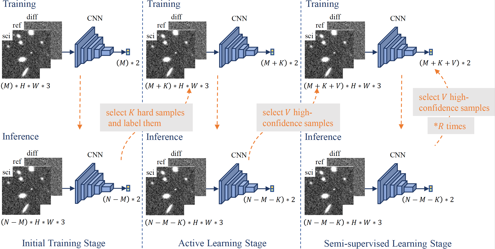

# RB-C1000: The Classification of Real and Bogus Transients using Active Learning and Semi-supervised Learning

The classification of real and bogus transients is a fundamental component in a real-time data processing system and is critical to enable rapid follow-up observations. Most existing methods (supervised learning) require sufficiently large training samples with corresponding labels, which involve costly human labeling and are challenging in the early stage of a time-domain survey. Different from most existing approaches which necessitate massive yet expensive annotated data, We aim to leverage training samples with only 1000 labels available to discover real sources that vary in brightness over time in the early stage of the WFST 6-year survey. The algorithm will be integrated into the WFST pipeline, enabling efficient and effective classification of transients in the early period of a time-domain survey.

