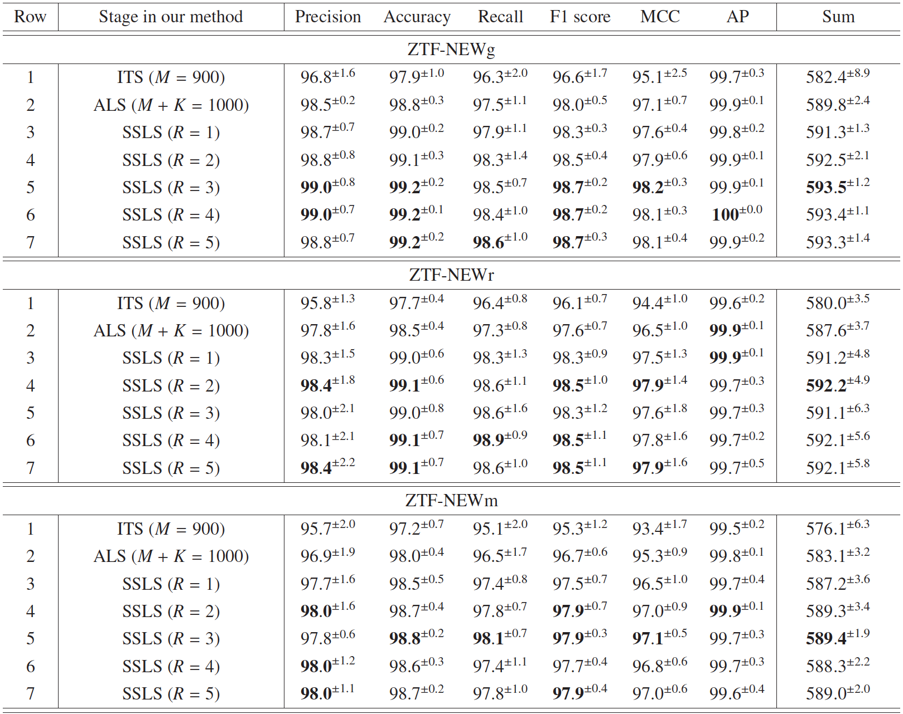

# RB-C1000: The Classification of Real and Bogus Transients using Active Learning and Semi-supervised Learning

The classification of real and bogus transients is a fundamental component in a real-time data processing system and is critical to enable rapid follow-up observations. Most existing methods (supervised learning) require sufficiently large training samples with corresponding labels, which involve costly human labeling and are challenging in the early stage of a time-domain survey. Different from most existing approaches which necessitate massive yet expensive annotated data, We aim to leverage training samples with only 1000 labels available to discover real sources that vary in brightness over time in the early stage of [the 2.5-meter Wide-Field Survey Telescope (WFST) 6-year survey](https://arxiv.org/abs/2306.07590). The algorithm will be integrated into the WFST pipeline, enabling efficient and effective classification of transients in the early period of a time-domain survey.

### RB-C1000 architecture

Our method follows a three-stage architecture:    
- **In the Initial Training Stage (ITS)**, each labeled sample undergoes convolutional neural network processing to train an initial model. Subsequently, domain experts annotate the $K$ most challenging samples, as determined by the initial model's judgments.   
- **During the Active Learning Stage (ALS)**, we employ the combined set of $(M+K)$ labeled samples to train an active training model. From this model, we select the top $V$ samples with high-confidence predictions and assign pseudo-labels to them.   
- **In the Semi-supervised Learning Stage (SSLS)**, we utilize the expanded dataset of $(M+K+V)$ samples to train a semi-supervised training model. This process is repeated for a total of $R$ iterations to obtain the final results.  

### Dataset

We have constructed new real/bogus classification datasets from [the Zwicky Transient Facility (ZTF)](https://arxiv.org/abs/1902.01932) to verify the effectiveness of our approach. We collected three newly compiled datasets for the real/bogus classification task, including two single-band datasets (ZTF-NEWg: g-band, ZTF-NEWr: r-band) and one mixed-band dataset (ZTF-NEWm: take half of the g-band data and half of the r-band data). Each of the three dataset with 13000 real sources and 30000 bogus detections. It can be downloaded at [here](https://drive.google.com/drive/folders/18zGGfTP13CqnD3J5aQBtE4zszDUSgldg?usp=sharing).

## Usage
### Train

Clone this project:

    git clone https://github.com/cherry0116/RB-C1000.git

We train the model on the following environments:

    Python 3.8
    Pytorch 1.13.1
    Torchvision 0.14.1 
    Torchaudio 0.13.1
    Cuda 11.6

You can go to the install directory and build the environment quickly by installing the requirements:

    cd install_folder
    conda env create -f astro_cls.yaml
    conda activate astro_cls
    pip install -r astro_cls.txt

We then go to the code directory and train the RB-C1000 model:
    
    cd ../cls_code
    CUDA_VISIBLE_DEVICES=0 python main.py

### Evaluate

After training the model will directly evaluate the performance. If you want to test a given checkpoint, you need to modify the "resume" of the "load_bestckpt.py" and then run:

    CUDA_VISIBLE_DEVICES=0 python load_bestckpt.py

### Other
In this article, we adopt "sum" as the final measurement metric and select the model parameters that yield the best sum value on the validation set, saving these optimal parameters as the final real/bogus classification model parameters. In actual code usage, you can choose one metric (Precision/Accuracy/Recall/F1 score/MCC/AP/Sum) that you prioritize and modify the select_model parameter to the chosen indicator.
For example, if you prioritize "Accuracy," you can run the following command to train the RB-C1000 model:

    CUDA_VISIBLE_DEVICES=0 python main.py --select_model Acc

Similarly, you can run the following command if you prioritize Precision/Recall/F1 score/MCC/AP:

    CUDA_VISIBLE_DEVICES=0 python main.py --select_model Pre
    
    CUDA_VISIBLE_DEVICES=0 python main.py --select_model Rec
    
    CUDA_VISIBLE_DEVICES=0 python main.py --select_model F1

    CUDA_VISIBLE_DEVICES=0 python main.py --select_model Mcc

    CUDA_VISIBLE_DEVICES=0 python main.py --select_model AP

### Performance

Take the ZTF-NEWg dataset as an example:

- Row 1: **In the Initial Training Stage (ITS)**, using 900 labeled samples, our model achieved an overall performance of 582.4\%, of which accuracy and recall were 97.9\% and 96.3\% respectively. This result demonstrates that our model can effectively distinguish real detections and bogus sources with a limited number of labeled data.
- Row 2: **In the Active Learning Stage (ALS)**, we incorporated an additional set of the $K$ challenging samples, which were determined by the model trained in the ITS. These $K$ samples were labeled by experts. By utilizing the $(M+K=1000)$ labeled samples for training in the ALS, the overall performance increased by 7.4\% compared to the overall result of the ITS.
- Row 3-7: **In the Semi-supervised Learning Stage (SSLS)**, we employed $V$ high-confidence samples, in addition to the labeled $(M+K)$ samples, to train the semi-supervised training model. By repeating the SSLS process for R=1, 2, 3, 4, and 5 iterations, we achieved respective overall performance indicators of 591.3\%, 592.5\%, 593.5\%, 593.4\%, and 593.3\%. This iterative process in the SSLS allowed us to refine the model's performance and enhance the accuracy and reliability of the final classification results. We notice that SSLS $(R = 3)$ often shows the best performance on the overall indicator on these three datasets we collected, so we set $R = 3$ in this paper.

## Contact

If you have any question about this project, please feel free to contact liuyat@mail.ustc.edu.cn.